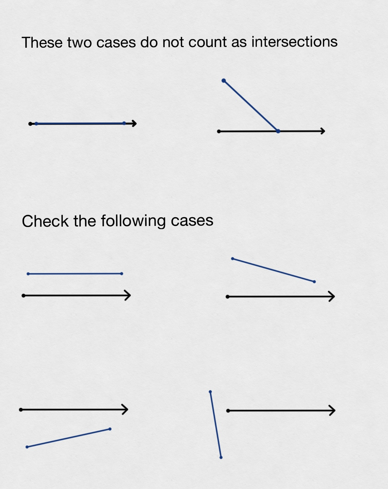
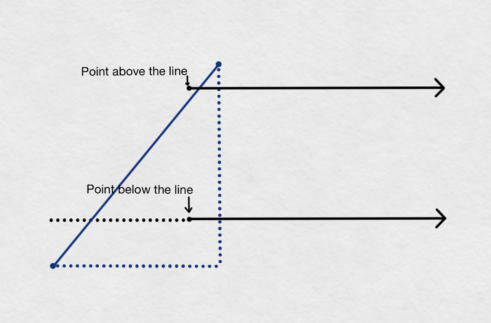

## Question 6

To check if a point is inside a polygon, a ray is drawn from the point from left to right, if this ray intersects with edges of polygon for odd number of times, then it is 

The following situations should not be considered as intersection.

<p align="center">
  
</p>


```python
# The ray is parallel to the edge
    if polygon_v1[1] == polygon_v2[1]:
        return False
    
    # The ray is above the edge
    elif point[1] > polygon_v1[1] and point[1] >  polygon_v2[1]:
        return False

    # The ray is below the edge
    elif point[1] < polygon_v1[1] and point[1] <  polygon_v2[1]:
        return False

    # The ray is at the right of the edge
    elif point[0] > polygon_v1[0] and point[0] >  polygon_v2[0]:
        return False

    # The ray pass through one of or both the vertices
    elif ((point[1] == polygon_v1[1] and point[1] < polygon_v2[1]) or
          (point[1] == polygon_v2[1] and point[1] < polygon_v1[1])):
        return False

    # The point of intersection is at the right of the ray
    elif (point[0] < polygon_v1[0] and point[0] <  polygon_v2[0] and
          (polygon_v1[1] < point[1] < polygon_v2[1] or polygon_v1[1] > point[1] > polygon_v2[1]) ):
        return True
```


To test if the point of intersection is at the left or right of side of the ray, the edge is considered as a linear function where the vertices are the points on that line. If the testing point is above the line, then the ray does not intersect with the edge.

<p align="center">
  
</p>
```python
# The point of intersection is at the left of the ray
    # Consider the edge as a function, if the point is above the
    # line, then the ray does not intersect with the edge.
    # slop = (v1_x-v2_x)/(v1_y-v2_y)
    elif ((polygon_v1[0]-polygon_v2[0])/(polygon_v1[1]-polygon_v2[1])*(point[0]-polygon_v1[0]) >
          (point[1]-polygon_v1[1])):
        return False

    else:
        return True
```


